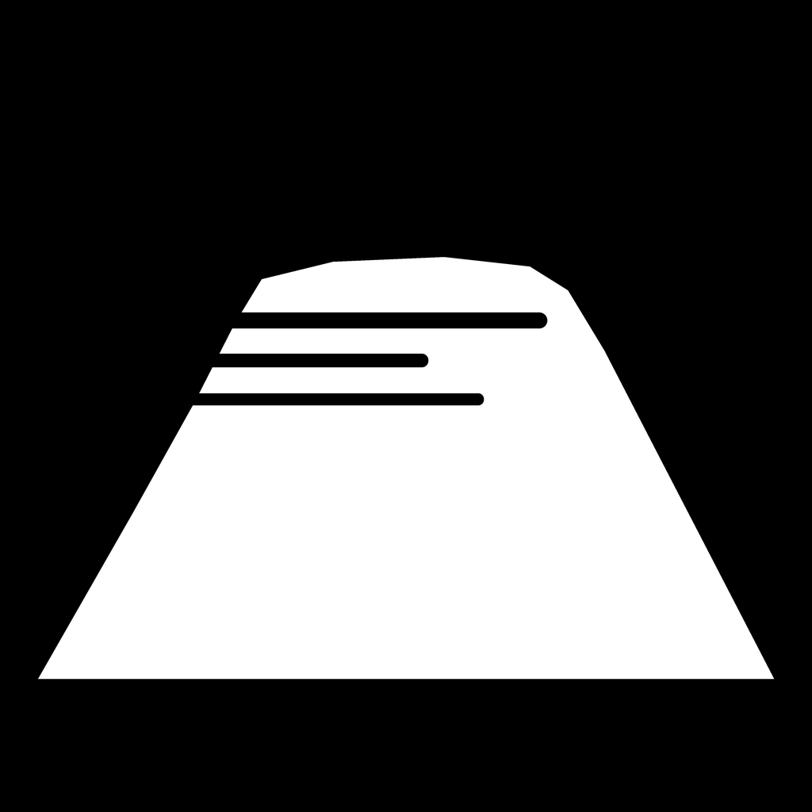

  

<h1 style="text-align: center;">Telo</h1>

<strong>Public transport app for Toulon and its surroundings</strong>

---

## About

**Telo** is a modern, open-source Kotlin Multiplatform application (Android and iOS) designed to easily navigate the Toulon public transport network (Réseau Mistral): bus, sea shuttles (bateaux-bus) and the Mont Faron cable car. Journey planning and schedules work fully offline from bundled GTFS data.

### Prerequisites

* Android 7.0 (API 24) or higher
* Android Studio Ladybug or higher
* JDK 11

### Transit data

Transit data comes from the Réseau Mistral GTFS feed published on [transport.data.gouv.fr](https://transport.data.gouv.fr/datasets/reseau-de-transport-urbain-de-la-metropole-toulon-provence-mediterranee) (Licence Ouverte v2.0), preprocessed with `raptor-gtfs-pipeline` into the binary files bundled under `app/src/commonMain/composeResources/files/raptor/`. Line badges are generated from the GTFS route colors with `tools/generate_mistral_icons.py`.
